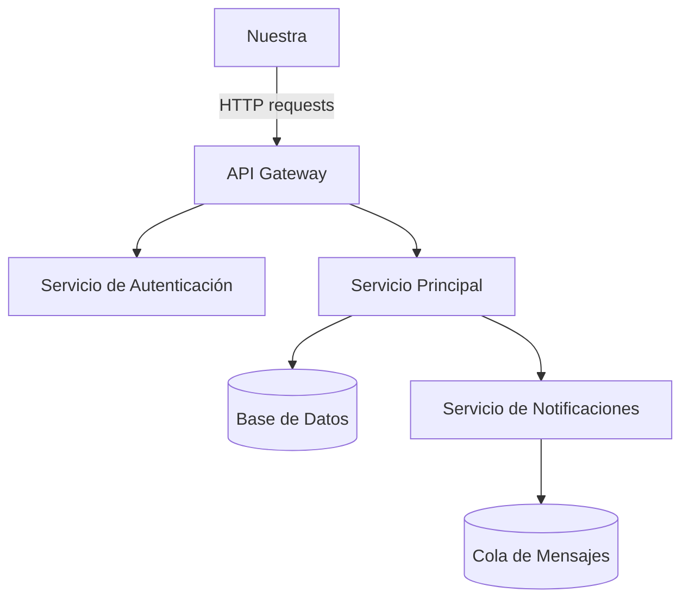

# La-Tiendita

## Descripcion 

Bienvenidos a La Tiendita virtual, donde encontraras todo lo que necesitas acerca de tecnologia y mas, si quieres adentrarte a nuestra pagina, primero lee nuestro markdown en el cual encontraras toda la informacion necesaria


## Tabla de contenidos

-[Instalacion](##Instalacion)

-[Uso](##Uso)

-[Estado de Funcionalidades](##Estado-de-funcionalidades)

-[Tareas Pendientes](#tareas-pendientes)

-[Arquitectura](#arquitectura)

## Instalacion

Estos son los pasos para instalar el README en su ordenador si usted lo desea.

```bash
git clone https://github.com/luischavezpe-droid/La-Tiendita.git 
cd La-Tiendita-readme
npm install
```

## Uso

```bash
# Ejecutar el proyecto
npm start
```
## Estado de funcionalidades

| Funcionalidad         | Estado           |
|------------------------|------------------|
| Autenticación de usuarios |  Completado    |
| API REST                  |  Completado    |
| Panel de administración   |  En progreso   |
| Notificaciones push       |  Pendiente     |
| Modo oscuro                |  Pendiente     |

### Tareas pendientes

- [ ] Implementar notificaciones push
- [ ] Agregar modo oscuro
- [ ] Escribir pruebas unitarias para el módulo de pagos
- [ ] Documentar la API con Swagger

## Arquitectura



## Contribuidores

El contribuidor mas grande para lograr realizar este README fue: Luis Ignacio Chavez Pereira.

Su usuario de GitHub:luischavezpe-droid